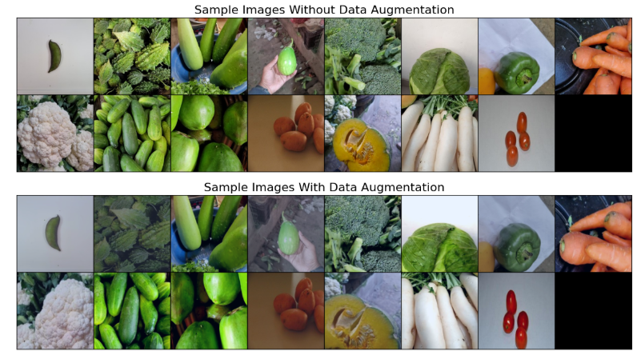
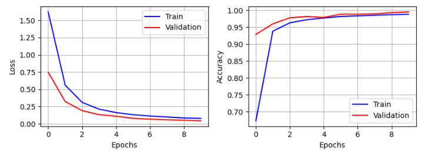
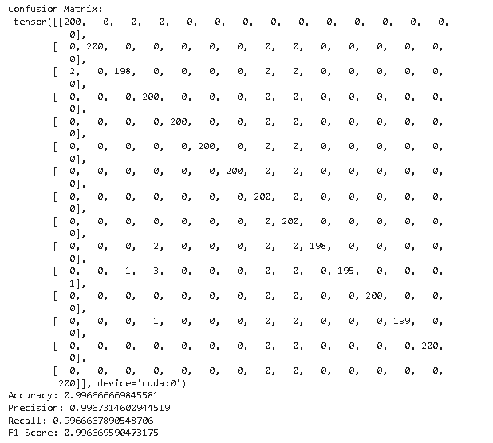

# Vegetable Image Classification with CNN, AlexNet, and ResNet18

This project trains three models to classify vegetable images into fifteen categories. I built a full workflow that handles data loading, preprocessing, model training, and evaluation. The goal is to compare a custom CNN, AlexNet, and ResNet18 on the same dataset and identify the strongest performer.

## Dataset
The dataset comes from Kaggle and includes fifteen vegetable classes such as Bean, Bottle Gourd, Brinjal, Broccoli, Papaya, Potato, Pumpkin, and Tomato. The images are divided into training, validation, and test sets. I used the training set to fit the models and tested the final performance on the reserved test set.

Sample images from the dataset below:

## Data Preparation
Each image is resized to 224x224 and normalised using ImageNet statistics. The training set includes colour adjustment, horizontal flipping, and random cropping to improve variation. The validation and test images follow a simple resize and normalisation process. This setup improves generalisation and keeps evaluation consistent.

## Models
I trained three models on the same input pipeline.

Custom CNN:
A convolutional network designed from scratch with three feature extraction blocks followed by fully connected layers.

AlexNet:
A deeper architecture with dropout layers and large fully connected blocks. This version uses the classic AlexNet design adapted for fifteen classes.

ResNet18:
A pretrained model where the final layer is replaced with a fifteen-class output. This model includes residual blocks that allow deeper training without degradation.

## Training and Evaluation
Each model was trained for several epochs. I monitored training loss and accuracy, along with validation performance after every epoch. After training, I evaluated each model using accuracy, precision, recall, F1 score, and a confusion matrix. This gives a clear view of the strengths and weaknesses of each approach.

Training curves (loss and accuracy):

## Performance Summary
The ResNet18 model delivered the strongest results. Transfer learning helped it reach high accuracy and stable predictions. AlexNet achieved solid performance but did not match ResNet18. The custom CNN performed well for a scratch model and showed good learning behaviour, but its overall accuracy stayed lower. The performance table is shown below.

| Model       | Accuracy | Precision | Recall | F1 Score |
|:------------|:--------:|:---------:|:------:|:--------:|
| ResNet18    | 0.99     | 0.99      | 0.99   | 0.99     |
| AlexNet     | 0.89     | 0.88      | 0.87   | 0.875    |
| Custom CNN  | 0.83     | 0.87      | 0.86   | 0.865    |

This is Confusion matrix for ResNet18:

## Skills Demonstrated
This project covers convolutional neural networks, transfer learning, image preprocessing, PyTorch training loops, metric evaluation, and model comparison. It also shows the ability to manage complete experiments and analyse results clearly.

